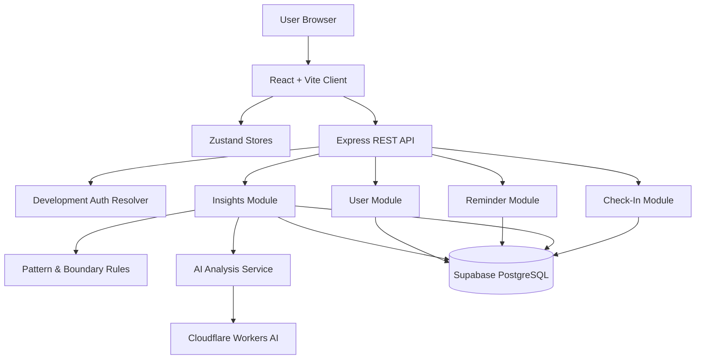

# Technical Design Document: Steady-Ahh MVP

## Overview

Steady-Ahh is a desktop-first responsive wellness web application that helps users record emotions and experiences, notice recurring patterns, identify possible emotional-exhaustion signals, and become more aware of personal boundaries.

This technical design follows the confirmed PRD and the user's technical preferences:

- PERN stack
- JavaScript only
- React + Vite frontend
- Node.js + Express backend
- PostgreSQL database
- Zustand client state management
- Hybrid architecture: feature-based client + responsibility-based server modules
- AI called only through the Express backend
- One AI analysis workflow; no multi-agent product architecture
- Development-only authentication bypass
- GitHub + local source ownership + `.env` secrets + Git rollback
- $0 planned operating/development budget during validation
- Three-month timeline with work sessions twice per week
- Desktop + mobile responsive experience

No Part 1 research findings file was provided with this technical-design request. Current vendor/technical facts below were verified against official documentation on September 18, 2026.

---

## Recommended Approach

### Best Path for Steady-Ahh: Full-code PERN + AI Assistance

The project should stay close to the user's existing PERN skills instead of moving to a full-stack framework or no-code backend.

**Why this fits:**

- Keeps React, Express, PostgreSQL, and JavaScript as the primary learning/building environment.
- Supports the requested hybrid structure cleanly.
- Keeps AI secrets server-side.
- Makes the core pattern/boundary logic explicit and testable instead of hiding it inside an AI provider.
- Can be developed locally and exported/deployed without being locked into an AI builder.
- Fits a small validation cohort better than microservices or agent orchestration.

### Decision Matrix

| Decision         | Recommended                           | Alternative 1        | Alternative 2                        | Why the recommendation fits                                                                                                                     |
| ---------------- | ------------------------------------- | -------------------- | ------------------------------------ | ----------------------------------------------------------------------------------------------------------------------------------------------- |
| Frontend         | React + Vite                          | Next.js              | React + another full-stack framework | Already matches the chosen stack; Vite provides a lean React build/dev workflow.                                                                |
| Client state     | Zustand                               | React Context        | Redux Toolkit                        | Small global state needs with low ceremony; feature stores remain easy to isolate.                                                              |
| Backend          | Node.js + Express                     | Fastify              | Next.js API routes                   | Existing PERN skill fit and clear module boundaries.                                                                                            |
| Database access  | `pg` + SQL migrations                 | Prisma               | Drizzle                              | Keeps PostgreSQL visible and avoids ORM abstraction for a learning-focused MVP.                                                                 |
| API style        | REST                                  | GraphQL              | tRPC                                 | Simple route contracts fit four core features.                                                                                                  |
| Styling          | CSS modules/plain CSS + design tokens | Tailwind CSS         | Component library                    | Keeps the UI lightweight and easy to understand.                                                                                                |
| Frontend hosting | Cloudflare Pages                      | Vercel Hobby         | Render Static Site                   | Free static hosting with globally distributed assets; avoids putting frontend on the sleeping backend.                                          |
| Backend hosting  | Render Free Web Service               | Cloudflare Worker    | Other cloud runtime                  | Native support for Node/Express with a simple Git deployment path.                                                                              |
| PostgreSQL       | Supabase Free Postgres                | Render Free Postgres | Self-hosted PostgreSQL               | Supabase gives a persistent free Postgres option; Render's free Postgres currently expires after 30 days.                                       |
| Product AI       | Cloudflare Workers AI via REST        | Gemini API free tier | Local Ollama                         | Workers AI currently provides a free daily allocation and states customer content is not used to train/improve models without explicit consent. |
| Testing          | Vitest + RTL + Supertest + Playwright | Jest + Cypress       | Vitest only                          | Covers client, API, and full user journeys without adding a large test stack.                                                                   |

---

## Architecture Overview

### High-Level Architecture



### Main Request Flow

```text
User action
   ↓
React feature component
   ↓
Feature API client
   ↓
Express route
   ↓
Validation + authorization context
   ↓
Feature service
   ↓
Repository / SQL
   ↓
PostgreSQL
   ↓
JSON response
   ↓
Zustand store update
   ↓
React UI
```

### Insight Analysis Flow

```text
New check-ins
   ↓
Deterministic pattern engine
   ↓
Candidate signals + structured evidence
   ↓
AI analysis service
   ↓
Cloudflare Workers AI
   ↓
Structured JSON result
   ↓
Zod validation
   ↓
Save user-facing insight
   ↓
Optional supportive reminder
   ↓
React renders insight/reminder
```

The deterministic rule layer should determine whether there is enough evidence for a signal. The AI should primarily explain observed patterns in understandable language. This limits the amount of authority given to the model and makes the core logic testable.

---

## Runtime and Version Strategy

Use an actively supported LTS Node.js release. As of September 18, 2026, Node.js 24.x is LTS; Node.js 22.x is also LTS, while Node.js 26.x is Current. Use Node 24 for this project unless an installed dependency requires another supported LTS branch. [Node.js Releases](https://nodejs.org/en/about/previous-releases) — accessed September 18, 2026.

Express currently requires Node.js 18 or higher, so Node 24 is compatible. [Express README](https://github.com/expressjs/express#readme) — accessed September 18, 2026.

---

## Tech Stack

### Frontend

- React
- Vite
- React Router
- Zustand
- Plain CSS/CSS Modules with CSS custom properties for design tokens
- `fetch` for API calls

Vite provides a development server with HMR and a production build command for optimized static assets. [Vite Getting Started](https://vite.dev/guide/) — accessed September 18, 2026.

### Backend

- Node.js 24 LTS
- Express
- `pg`
- Zod for request/response validation
- Helmet for security headers
- CORS configured for the deployed client origin
- `express-rate-limit` for sensitive endpoints, especially AI analysis
- dotenv for environment loading in local development

### Database

- PostgreSQL through Supabase Free Postgres
- SQL migrations tracked in Git
- No ORM in MVP

### AI

- Cloudflare Workers AI through the REST API
- Provider adapter so the AI provider can be changed later
- JSON/structured output where supported
- Server-side secret storage

Cloudflare's current Workers AI REST API supports calling models from an existing application using an account ID and API token. [Workers AI REST API](https://developers.cloudflare.com/workers-ai/get-started/rest-api/) — accessed September 18, 2026.

### Testing

- Vitest
- React Testing Library
- Supertest
- Playwright

---

## Project Structure

The project uses the requested hybrid structure: **features on the client, modules by responsibility on the server**.

```text
steady-ahh/
├── client/
│   ├── public/
│   └── src/
│       ├── app/
│       │   ├── App.jsx
│       │   ├── router.jsx
│       │   └── stores/
│       ├── features/
│       │   ├── checkins/
│       │   │   ├── api.js
│       │   │   ├── components/
│       │   │   ├── hooks/
│       │   │   ├── pages/
│       │   │   └── store.js
│       │   ├── insights/
│       │   │   ├── api.js
│       │   │   ├── components/
│       │   │   ├── pages/
│       │   │   └── store.js
│       │   ├── reminders/
│       │   │   ├── api.js
│       │   │   └── components/
│       │   └── boundaries/
│       │       ├── components/
│       │       └── pages/
│       ├── components/
│       │   ├── ui/
│       │   └── layout/
│       ├── lib/
│       │   ├── api/
│       │   ├── constants/
│       │   └── utils/
│       └── styles/
│           ├── tokens.css
│           └── globals.css
│
├── server/
│   └── src/
│       ├── app.js
│       ├── server.js
│       ├── config/
│       │   └── env.js
│       ├── middleware/
│       │   ├── auth.js
│       │   ├── error.js
│       │   ├── rateLimit.js
│       │   └── validate.js
│       ├── modules/
│       │   ├── checkins/
│       │   │   ├── checkins.routes.js
│       │   │   ├── checkins.controller.js
│       │   │   ├── checkins.service.js
│       │   │   ├── checkins.repository.js
│       │   │   └── checkins.validation.js
│       │   ├── insights/
│       │   │   ├── insights.routes.js
│       │   │   ├── insights.controller.js
│       │   │   ├── insights.service.js
│       │   │   ├── insights.repository.js
│       │   │   └── insights.validation.js
│       │   ├── reminders/
│       │   │   ├── reminders.routes.js
│       │   │   ├── reminders.controller.js
│       │   │   ├── reminders.service.js
│       │   │   └── reminders.repository.js
│       │   └── users/
│       │       ├── users.routes.js
│       │       └── users.repository.js
│       ├── services/
│       │   ├── ai/
│       │   │   ├── ai.service.js
│       │   │   ├── cloudflare.provider.js
│       │   │   ├── prompt.js
│       │   │   └── outputSchema.js
│       │   └── patterns/
│       │       ├── burnout.rules.js
│       │       ├── boundary.rules.js
│       │       └── pattern.service.js
│       ├── db/
│       │   ├── pool.js
│       │   ├── migrations/
│       │   └── seeds/
│       └── utils/
│
├── e2e/
├── .env.example
├── .gitignore
├── package.json
└── README.md
```

### Structure Rules

- `features/` owns user-facing client functionality.
- Shared UI belongs in `components/ui` only when it is genuinely reused.
- A feature may not import another feature's private implementation files directly; use a public API file when cross-feature access is required.
- Server `modules/` own routes, controllers, business services, repositories, and validation for that domain.
- `services/` contain cross-domain capabilities such as AI and pattern analysis.
- Repositories perform data access; controllers should not write SQL directly.
- Business rules must not live in React components.

---

## Client Architecture

### Routing

Recommended routes:

```text
/
/dashboard
/check-in
/insights
/boundaries
/settings
```

During development, route protection is disabled through the development flag described in the Authentication section. In production/beta, protected routes must use a real authentication mechanism before collecting real users' wellness data.

### Zustand Usage

Use Zustand only for client state that benefits from persistence across components/routes:

- Current dashboard data
- Current check-in draft
- Insight loading/error state
- Reminder read state
- Development user context

Do not put server state into a giant global store. Feature stores should remain small.

### API Client Pattern

Use one shared request utility under `client/src/lib/api/` for:

- base URL
- JSON headers
- common error parsing
- development logging

Feature API modules call the shared request helper and should not duplicate request configuration.

---

## Server Architecture

### Layer Responsibilities

**Routes**

- Map HTTP endpoints to controllers.
- Apply middleware.

**Controllers**

- Read validated request data.
- Call the feature service.
- Return consistent HTTP responses.

**Services**

- Implement business rules.
- Coordinate repositories, deterministic pattern analysis, and AI services.

**Repositories**

- Run parameterized SQL.
- Return database records.
- Never construct user-facing AI messages.

**Validation**

- Validate request bodies, params, query strings, and AI output.

### Error Contract

Use one consistent JSON shape for API errors:

```json
{
  "error": {
    "code": "VALIDATION_ERROR",
    "message": "The check-in could not be saved.",
    "details": []
  }
}
```

Do not send stack traces to users.

---

## Database Design

### Core Tables

#### `users`

| Column       | Type          | Notes         |
| ------------ | ------------- | ------------- |
| `id`         | `uuid`        | Primary key   |
| `created_at` | `timestamptz` | Creation time |

Authentication details remain outside this table until the real auth mechanism is selected.

#### `checkins`

| Column         | Type          | Notes                               |
| -------------- | ------------- | ----------------------------------- |
| `id`           | `uuid`        | Primary key                         |
| `user_id`      | `uuid`        | Foreign key to `users.id`           |
| `occurred_at`  | `timestamptz` | When the experience happened        |
| `mood_score`   | `smallint`    | Product scale to be finalized       |
| `energy_score` | `smallint`    | Product scale to be finalized       |
| `drain_score`  | `smallint`    | Product scale to be finalized       |
| `emotions`     | `text[]`      | Selected emotion tags               |
| `context_tags` | `text[]`      | Optional situation/interaction tags |
| `note`         | `text`        | Optional user description           |
| `created_at`   | `timestamptz` | Record creation time                |

#### `analysis_runs`

Stores analysis metadata, not raw prompts.

| Column                | Type          | Notes                            |
| --------------------- | ------------- | -------------------------------- |
| `id`                  | `uuid`        | Primary key                      |
| `user_id`             | `uuid`        | Foreign key                      |
| `started_at`          | `timestamptz` | Run start                        |
| `completed_at`        | `timestamptz` | Nullable until complete          |
| `status`              | `text`        | `running`, `completed`, `failed` |
| `input_checkin_count` | `integer`     | Number of records considered     |
| `latest_checkin_at`   | `timestamptz` | Last record included             |
| `provider`            | `text`        | Provider name                    |
| `model`               | `text`        | Model identifier                 |
| `error_code`          | `text`        | Nullable                         |

#### `insights`

| Column            | Type          | Notes                                                       |
| ----------------- | ------------- | ----------------------------------------------------------- |
| `id`              | `uuid`        | Primary key                                                 |
| `user_id`         | `uuid`        | Foreign key                                                 |
| `analysis_run_id` | `uuid`        | Foreign key                                                 |
| `insight_type`    | `text`        | Pattern/burnout/boundary/general                            |
| `title`           | `text`        | User-visible title                                          |
| `summary`         | `text`        | User-visible explanation                                    |
| `evidence`        | `jsonb`       | Structured supporting observations                          |
| `confidence`      | `text`        | `low`, `medium`, or `high`; product wording to be validated |
| `suggestions`     | `jsonb`       | Optional supportive suggestions                             |
| `created_at`      | `timestamptz` | Creation time                                               |

#### `reminders`

| Column       | Type          | Notes                    |
| ------------ | ------------- | ------------------------ |
| `id`         | `uuid`        | Primary key              |
| `user_id`    | `uuid`        | Foreign key              |
| `insight_id` | `uuid`        | Nullable link to insight |
| `kind`       | `text`        | Supportive reminder type |
| `message`    | `text`        | User-visible message     |
| `read_at`    | `timestamptz` | Nullable                 |
| `created_at` | `timestamptz` | Creation time            |

### Important Indexes

Create only indexes required by real queries:

- `checkins(user_id, occurred_at desc)`
- `insights(user_id, created_at desc)`
- `reminders(user_id, created_at desc)`
- `analysis_runs(user_id, started_at desc)`

### Database Rules

- Use foreign keys.
- Use `NOT NULL` where the application always requires a value.
- Use check constraints for score ranges once the product scale is finalized.
- Use parameterized queries.
- Never interpolate user input into SQL strings.

PostgreSQL 18 is the current major release as of September 18, 2026; use the provider-managed version rather than manually managing database upgrades in the MVP. [PostgreSQL Documentation](https://www.postgresql.org/docs/) — accessed September 18, 2026.

---

## Proposed Check-In Data Model

The current PRD does not define the exact check-in questionnaire. The following is a technical proposal, not a locked product decision:

```text
Mood             1–5
Energy           1–5
Drain            1–5
Emotions        multiple tags
Context tags    optional multiple tags
What happened   optional text
```

For Boundary Awareness, consider adding one explicit reflection input such as:

```text
Did you feel pressured to agree or prioritize someone else's needs?
- No
- Unsure
- Yes
```

This is recommended because mood and energy alone cannot reliably support boundary-awareness analysis.

**Open product decision:** finalize the check-in questions during implementation/testing rather than assuming the above values are clinically meaningful.

---

## Feature Design

### Feature 1: Daily Check-In

**Flow**

```text
Check-In page
  ↓
Select mood/energy/drain
  ↓
Select emotions/context tags
  ↓
Optional note
  ↓
Client validation
  ↓
POST /api/check-ins
  ↓
Server validation
  ↓
Insert PostgreSQL row
  ↓
Run lightweight deterministic pattern checks
  ↓
Return saved check-in + any immediate reminder
```

**Complexity:** Medium

**Main tests**

- valid submission saves
- invalid score rejected
- empty required fields rejected
- user cannot access another user's record
- database failure produces safe error response

### Feature 2: Pattern / Burnout Signal Detection

Do not begin with a machine-learning classifier. Use a deterministic product rule engine for the first MVP.

The rule engine may consider:

- frequency of recent check-ins
- energy trend
- drain trend
- repeated contexts
- repeated emotional tags
- optional boundary-pressure responses

Example provisional configuration:

```text
BURNOUT_SIGNAL_WINDOW_DAYS=7
BURNOUT_SIGNAL_MIN_CHECKINS=3
LOW_ENERGY_MAX=2
HIGH_DRAIN_MIN=4
```

These numbers are product heuristics only and must be treated as configurable validation parameters, not medical thresholds.

**Complexity:** Medium/Hard

**Reason for deterministic rules:**

- easier to test
- cheaper than AI-only classification
- easier to explain
- easier to change after beta feedback
- reduces the chance that a model makes a high-impact health judgment

### Feature 3: Personal Insights

**Flow**

```text
User opens Insights
   ↓
GET latest successful analysis
   ↓
If new check-ins exist → POST /api/insights/analyze
   ↓
Load only required user's data
   ↓
Run deterministic pattern engine
   ↓
Build compact analysis payload
   ↓
Call AI provider
   ↓
Validate structured response
   ↓
Store insight
   ↓
Return insight cards
```

Use a manual/explicit analysis trigger first instead of an autonomous background agent.

This keeps the workflow simple and prevents repeated AI calls when nothing has changed.

### Feature 4: Boundary Awareness

Boundary insights should be phrased as observations:

```text
Observed:
"Several recent check-ins mention feeling drained after agreeing to plans."

Reflection:
"You may want to notice whether you are saying yes when you would rather say no."
```

Avoid:

```text
"This person is toxic."
"You must cancel this plan."
```

The product should help the user interpret their own experience, not make decisions about other people on the user's behalf.

**Complexity:** Medium

---

## API Design

### Check-Ins

```text
POST   /api/check-ins
GET    /api/check-ins
GET    /api/check-ins/:id
```

### Insights

```text
GET    /api/insights
GET    /api/insights/:id
POST   /api/insights/analyze
```

### Reminders

```text
GET    /api/reminders
PATCH  /api/reminders/:id/read
```

### Dashboard

```text
GET    /api/dashboard/summary
```

### Health

```text
GET    /api/health
```

### API Boundary Rules

- Validate every write request with Zod.
- Scope every database query by `req.user.id`.
- Do not accept a client-supplied arbitrary `user_id` for normal user operations.
- Return only the fields the client needs.
- Apply rate limiting to `/api/insights/analyze`.

OWASP's API Security Top 10 highlights risks such as broken object-level authorization, broken authentication, unrestricted resource consumption, and security misconfiguration. Those risks are directly relevant to an API that stores private wellness records. [OWASP API Security Top 10](https://devguide.owasp.org/en/07-training-education/07-api-top-ten/) — accessed September 18, 2026.

---

## Development Authentication Bypass

### Requirement

The project needs a development mode in which the AI coding workflow can open and use project pages without normal authentication.

### Safe Implementation

Use environment variables on the **server**:

```text
NODE_ENV=development
DEV_AUTH_BYPASS=true
DEV_USER_ID=<development-user-uuid>
```

Optional client-only setting:

```text
VITE_DEV_AUTH_BYPASS=true
```

The client flag should only skip UI route redirects during local development. It is not a security boundary.

### Server Behavior

```text
if NODE_ENV === development
and DEV_AUTH_BYPASS === true
    resolve req.user from DEV_USER_ID
else
    use real authentication middleware
```

### Mandatory Safety Rules

- Never hardcode the development user ID in application source.
- Never trust the browser to select the user ID.
- Fail startup if `DEV_AUTH_BYPASS=true` while `NODE_ENV=production`.
- Fail startup if the bypass is enabled but `DEV_USER_ID` is missing or invalid.
- Do not expose `DEV_USER_ID` or database credentials to the client.
- Keep `.env` out of Git.
- Before the external 10–20-user beta, replace the bypass with actual authentication.

This bypass exists for development convenience and AI-assisted implementation; it is not an MVP production authentication strategy.

---

## Environment Configuration

### Server `.env`

```text
NODE_ENV=development
PORT=5000
CLIENT_ORIGIN=http://localhost:5173
DATABASE_URL=<supabase-postgresql-connection-string>
DEV_AUTH_BYPASS=true
DEV_USER_ID=<development-user-uuid>
AI_PROVIDER=cloudflare
CLOUDFLARE_ACCOUNT_ID=<cloudflare-account-id>
CLOUDFLARE_API_TOKEN=<server-only-token>
CLOUDFLARE_AI_MODEL=<currently-free-workers-ai-model>
AI_ANALYSIS_RATE_LIMIT=5
AI_MAX_INPUT_CHARS=<configured-limit>
```

### Client `.env`

```text
VITE_API_URL=http://localhost:5000/api
VITE_DEV_AUTH_BYPASS=true
```

Never place:

```text
DATABASE_URL
CLOUDFLARE_API_TOKEN
```

in the client environment.

---

## Product AI Architecture

### AI Provider Decision

**Primary:** Cloudflare Workers AI through the REST API.

**Why:**

- Workers AI is available on Cloudflare's Free plan.
- The current free allocation is 10,000 Neurons per day.
- Cloudflare states that Workers AI customer content is not used to train the AI models or improve Cloudflare/third-party services unless explicit consent is given.
- It can be called from the Express server over the REST API, so the client never needs the provider credential.
- Workers AI supports JSON Mode for structured responses.

Current docs also note that some models have moved to paid-only access, so model availability must be verified at implementation time. [Workers AI Pricing](https://developers.cloudflare.com/workers-ai/platform/pricing/) and [Workers AI Data Usage](https://developers.cloudflare.com/workers-ai/platform/data-usage/) — accessed September 18, 2026.

### Alternatives

| Provider              | Cost path                            | Privacy signal                                                                         | Main limitation for Steady-Ahh                                                        |
| --------------------- | ------------------------------------ | -------------------------------------------------------------------------------------- | ------------------------------------------------------------------------------------- |
| Cloudflare Workers AI | Current free allocation available    | Cloudflare says customer content is not used to train/improve without explicit consent | Model availability and free allocation vary.                                          |
| Gemini API Free Tier  | Free tier exists for selected models | Current pricing page states Free Tier content is used to improve products              | Not the preferred path for sensitive real-user wellness notes under a $0 requirement. |
| Ollama/local model    | No hosted API charge                 | Data can stay local                                                                    | Not practical for public hosted users unless the deployed server runs the model.      |

Google's current Gemini API pricing page states that content on the Free Tier may be used to improve products, so it should not be the default destination for raw sensitive wellness data without an explicit policy review. [Gemini API Pricing](https://ai.google.dev/gemini-api/docs/pricing) — accessed September 18, 2026.

### AI Data Boundary

The AI service should receive:

- recent user check-in data needed for the selected analysis period
- deterministic pattern candidates
- compact aggregate metrics
- optional user notes needed for context

It should not receive:

- passwords
- API credentials
- session secrets
- unrelated account information
- other users' data
- database connection strings

### AI Output Contract

Use a structured result similar to:

```json
{
  "insights": [
    {
      "type": "pattern",
      "title": "Recurring energy drain",
      "summary": "...",
      "evidence": ["..."],
      "confidence": "medium",
      "suggestions": ["..."]
    }
  ],
  "reminder": {
    "shouldShow": true,
    "message": "..."
  }
}
```

The exact schema should be represented as a Zod schema in the server and rejected if invalid.

Cloudflare Workers AI currently supports JSON Mode and JSON-schema-style structured output. [Workers AI JSON Mode](https://developers.cloudflare.com/workers-ai/features/json-mode/) — accessed September 18, 2026.

### AI Prompt Rules

System-level rules should require the model to:

- describe observations as observations
- state uncertainty when evidence is weak
- avoid medical diagnosis
- avoid telling the user what they must do
- avoid judging or labeling third parties
- use only the supplied user data
- not invent events or evidence
- keep suggestions supportive and optional
- return only the required structured schema

### AI Failure Behavior

If the AI call fails:

1. Do not block the user from viewing their check-ins.
2. Show the last successful insight if available.
3. Show a neutral "Insights are temporarily unavailable" message.
4. Log only non-sensitive metadata about the failure.
5. Never log the raw wellness prompt or full AI output by default.

---

## Deterministic Pattern Engine

The pattern engine should live in:

```text
server/src/services/patterns/
```

### Responsibilities

- aggregate recent check-ins
- calculate trend signals
- identify repeated context tags
- identify repeated emotional tags
- identify energy/drain combinations
- identify candidate boundary-pressure patterns if that field is added

### Non-responsibilities

- diagnosing a medical condition
- deciding who is harmful
- automatically changing user plans
- contacting third parties
- making external decisions

### Example internal output

```json
{
  "signals": [
    {
      "type": "possible_burnout_pattern",
      "evidence": {
        "windowDays": 7,
        "checkins": 4,
        "lowEnergyCount": 3,
        "highDrainCount": 3
      }
    }
  ]
}
```

The AI then turns this evidence into user-facing language.

---

## Security Design

### Authentication

- Development: environment-controlled bypass.
- External beta/production: real authentication required before real user data is collected.
- Every API query must be scoped to the authenticated user.

### Authorization

For every resource:

```text
request user → resource user_id → must match
```

Never rely on hidden UI controls to enforce ownership.

### Security Headers

Use Helmet in Express.

Configure:

- Content Security Policy suitable for the final frontend deployment
- Referrer Policy
- X-Content-Type-Options
- Frame protection
- HSTS in HTTPS deployment after verifying domain/hosting configuration

### CORS

Allow only:

```text
http://localhost:5173
```

in local development and the exact production frontend origin in deployment.

Do not use `*` for authenticated API traffic.

### Rate Limiting

Rate-limit expensive endpoints, especially:

```text
POST /api/insights/analyze
```

The exact limit is configurable and should be tuned during beta based on free AI quota and user behavior.

### Sensitive Data Logging Rule

Never log:

- full check-in notes
- full AI prompts
- full AI responses
- auth tokens
- database credentials
- session tokens

Log only IDs, status codes, timing, and safe error codes.

---

## Testing Strategy

### Client Tests

Use Vitest + React Testing Library.

Test:

- check-in form validation
- Zustand store updates
- insight loading/error states
- reminder read state
- accessibility behavior of important controls

### Backend Tests

Use Vitest + Supertest.

Test:

- route validation
- repository queries
- ownership checks
- pattern rules
- AI output validation
- rate limit behavior
- development auth bypass
- production guard against auth bypass

### End-to-End Tests

Use Playwright for the critical journey:

```text
Open app
  ↓
Open Check-In
  ↓
Submit valid check-in
  ↓
Confirm data appears
  ↓
Open Insights
  ↓
Run analysis
  ↓
Confirm structured insight renders
  ↓
Confirm reminder behavior when test data meets configured rule
```

### AI Evaluation Set

Maintain a small fixture set under:

```text
e2e/ai-fixtures/
```

Include:

- direct obvious pattern
- indirect pattern
- insufficient data
- conflicting signals
- repeated boundary-pressure signal
- no-signal case
- AI malformed JSON case
- provider timeout/failure
- user-data isolation case

The evaluation should check both structure and language safety.

---

## Visual Verification Loop

For UI changes:

1. Generate the UI implementation.
2. Run the local Vite app.
3. Inspect the rendered screen.
4. Compare against the PRD's calm/friendly/trustworthy principles.
5. Check desktop and responsive layouts.
6. Fix visual issues.
7. Run automated tests.
8. Commit the verified state.

This should be used especially for the Landing Page, Dashboard, Check-In, and Insights pages.

---

## Development Workflow

### Git Strategy

Use a lightweight GitHub Flow:

```text
main
 ├── feature/checkin
 ├── feature/insights
 ├── feature/reminders
 └── feature/ui-dashboard
```

Rules:

- Keep `main` runnable.
- One feature per branch where practical.
- Commit after each verified milestone.
- Do not commit `.env` files.
- Use pull requests when a change touches multiple modules or core data logic.

### AI-Assisted Coding Workflow

**Simple UI work**

- AI scaffolds the component.
- User reviews and adjusts.

**Core business logic**

- User first defines the rule.
- AI proposes implementation.
- User reviews the logic.
- Tests are written before or alongside the change.

**Complex bugs**

- Provide the exact error and relevant files.
- Ask AI to diagnose before changing code.
- Apply the smallest fix.
- Run the affected tests.

**Architecture changes**

- Do not allow an AI coding tool to restructure modules without an approved design change.

### Lead Agent Rule

Use one lead coding agent for the product implementation. Do not add product subagents, MCP servers, or workflow graphs for this MVP.

Subagents may be used only for isolated development reviews, such as:

- read-only security audit
- test review
- UI review

---

## Project Initialization

### Root Setup

```bash
mkdir steady-ahh
cd steady-ahh
git init
npm init -y
npm install -D concurrently
```

### Frontend Setup

```bash
npm create vite@latest client -- --template react
cd client
npm install
npm install react-router-dom zustand
npm install -D vitest @testing-library/react @testing-library/jest-dom
cd ..
```

### Backend Setup

```bash
mkdir server
cd server
npm init -y
npm install express cors helmet express-rate-limit dotenv pg zod
npm install -D nodemon vitest supertest
cd ..
```

### Root Scripts

Use the root package only as an orchestration layer:

```text
npm run dev
npm run lint
npm run test
npm run build
```

The exact workspace script definitions should be created by the coding agent after the client/server package scripts are finalized.

### Exact Command Contract

```text
setup: npm install

dev: npm run dev

test: npm run test

typecheck: node -e "console.log('JavaScript project: no TypeScript typecheck configured')"

lint: npm run lint

build: npm run build
```

Because the project intentionally uses JavaScript instead of TypeScript, `typecheck` is a no-op status command rather than a TypeScript compiler step.

---

## Deployment Plan

### Frontend: Cloudflare Pages

Use a static Vite build.

- Repository: GitHub
- Build command: `npm run build` from the client project/workspace
- Output directory: `dist`
- Public environment variable: `VITE_API_URL`

Cloudflare Pages serves static assets through its globally distributed network. Its Free plan currently allows 500 builds/month and up to 20,000 files per project. [Cloudflare Pages Limits](https://developers.cloudflare.com/pages/platform/limits/) — accessed September 18, 2026.

### Backend: Render Free Web Service

Deploy the Express server as a Render Web Service.

Render supports Node.js/Express web services and deploys from a linked Git branch. Its Free web service plan currently spins down after 15 minutes without inbound traffic and can take about a minute to wake, so this is a known trade-off against the $0 budget. [Render Web Services](https://render.com/docs/web-services) and [Render Free](https://render.com/docs/free) — accessed September 18, 2026.

### Database: Supabase Free Postgres

Use Supabase only for hosted PostgreSQL in MVP. Access PostgreSQL with `pg`; do not require the Supabase JavaScript client for core data access.

The current Supabase Free plan lists a 500 MB database, two free projects, and project pausing after a week of inactivity. [Supabase Pricing](https://supabase.com/pricing) — accessed September 18, 2026.

### AI: Cloudflare Workers AI

Keep the account ID and API token in Render's server environment. React never calls Workers AI directly.

Current Cloudflare docs list 10,000 free Neurons/day on the Workers Free plan for Workers AI, and the platform's data-use documentation says customer content is not used to train models or improve Cloudflare/third-party services without explicit consent. [Workers AI Pricing](https://developers.cloudflare.com/workers-ai/platform/pricing/) and [Workers AI Data Usage](https://developers.cloudflare.com/workers-ai/platform/data-usage/) — accessed September 18, 2026.

---

## Cost Analysis

### Planned Monthly Cost

| Service               | Plan            | Planned cost | Important caveat                                  |
| --------------------- | --------------- | -----------: | ------------------------------------------------- |
| GitHub                | Free            |           $0 | Repository/source-control limits apply.           |
| Cloudflare Pages      | Free            |           $0 | Static site limits apply.                         |
| Render Express API    | Free            |           $0 | Sleeps when idle; intended for testing/hobby use. |
| Supabase Postgres     | Free            |           $0 | 500 MB and inactivity pause limits apply.         |
| Cloudflare Workers AI | Free allocation |   $0 planned | 10,000 Neurons/day; model access can change.      |
| **Planned total**     |                 | **$0/month** | Verify current limits before launch.              |

The free deployment is appropriate for a small validation cohort, not a guarantee of production-grade uptime or unlimited AI usage.

---

## Performance Strategy

### Frontend

- Keep the initial bundle small.
- Lazy-load noncritical route code where it meaningfully reduces initial work.
- Avoid global state for local-only UI state.
- Load charts/advanced visualizations only on the Insights route.
- Use lightweight CSS rather than a large component library.

### API

- Avoid repeated duplicate requests.
- Return only required fields.
- Use pagination for check-in history if the dataset grows.
- Add database indexes based on actual query patterns.

### AI

- Send summarized/compact analysis payloads instead of the entire database.
- Analyze only when new data exists.
- Cap input size.
- Rate-limit requests.
- Store the result rather than regenerating it on every page load.

### Known Free-tier Performance Trade-off

The Render free backend can sleep after idle time. The first request after sleep may be noticeably slower. This is accepted for validation because the budget is fixed at $0.

---

## Privacy and Data Retention Strategy

Because the product handles emotional and wellness information, privacy should be treated as a first-class design requirement even for a prototype.

### Minimum Data Collection

Collect only what is needed to deliver the four MVP features.

### AI Data Minimization

Send only the user's own relevant records for the analysis window.

### Logs

No raw emotional notes or raw AI prompts in application logs by default.

### User Data Controls

Before external beta, provide at least:

- account/data ownership explanation
- deletion path for user records
- privacy notice
- AI data-use explanation
- clear statement that AI insights are not medical diagnosis

### Authentication Gate

The development auth bypass is not sufficient for external beta. Real authentication and user isolation are required before real users contribute private wellness data.

---

## 3-Month Implementation Plan

The user can work on the project twice per week, so the plan favors focused milestones rather than a daily schedule.

### Weeks 1–2: Foundation

Session goals:

- create GitHub repository
- scaffold React/Vite + Express
- configure Node 24
- establish hybrid folders
- connect PostgreSQL
- create migrations
- add health endpoint
- add development auth bypass
- set up lint/test commands

Deliverable:

```text
React → Express → PostgreSQL works locally.
```

### Weeks 3–4: Check-In

- finalize check-in fields
- create database table
- implement API routes
- implement React Check-In page
- add Zustand check-in state
- write tests
- verify mobile layout

Deliverable:

```text
User can create and review check-ins.
```

### Weeks 5–6: Pattern Engine

- implement deterministic signal rules
- write fixtures for pattern cases
- add reminder logic
- build Dashboard reminder area
- tune thresholds with test data

Deliverable:

```text
The system can identify configurable pattern signals without AI.
```

### Weeks 7–8: AI Insights

- create provider adapter
- configure Cloudflare Workers AI
- define structured output schema
- implement `/api/insights/analyze`
- validate AI output
- store insights
- add failure fallback
- add rate limiting

Deliverable:

```text
User can request an analysis and receive a structured personal insight.
```

### Weeks 9–10: Boundary Awareness + Dashboard

- implement boundary-related evidence
- refine insight presentation
- build Dashboard summary
- build Insights page
- add reminder read state
- run accessibility review

Deliverable:

```text
The core four-feature journey works end-to-end.
```

### Weeks 11–12: Validation Readiness

- implement minimum production auth
- privacy/data deletion controls
- deploy frontend/backend/database
- configure environment variables
- run Playwright tests
- test failure cases
- test mobile
- prepare tester feedback form
- onboard 10–20 users
- collect validation findings

Deliverable:

```text
Deployed validation MVP ready for 10–20 users.
```

---

## Builder Exit Review

If an AI builder is used for UI scaffolding:

### Source Ownership

- GitHub repository must contain the actual project code.
- The local repository must build without the builder.
- No critical business logic should exist only inside a builder configuration.

### Local Verification

The exported/local project must support:

```text
npm install
npm run dev
npm run test
npm run build
```

### Secrets

- AI API token only on the server.
- Database URL only on the server.
- `.env` ignored by Git.
- `.env.example` contains names only, not real secrets.

### Rollback

Use Git commits as the primary rollback mechanism.

Suggested checkpoints:

```text
foundation-complete
checkin-complete
pattern-engine-complete
ai-insights-complete
validation-ready
```

---

## Limitations and Trade-offs

### 1. Render Free Backend Sleeps

**Impact:** first request after inactivity may be slower.

**Workaround:** keep user-facing static assets on Cloudflare Pages and avoid unnecessary API requests during initial page load.

### 2. Free AI Quota Is Finite

**Impact:** analysis requests can eventually hit the daily quota.

**Workaround:** deterministic pre-filtering, one analysis per new-data batch, rate limiting, and stored results.

### 3. AI Quality Is Not Guaranteed

**Impact:** model output may be ambiguous or incorrect.

**Workaround:** deterministic evidence layer, structured output, Zod validation, safety prompt rules, and evaluation fixtures.

### 4. Authentication Is Temporarily Bypassed in Development

**Impact:** unsafe for public use.

**Workaround:** keep the bypass environment-gated and block it in production; implement actual auth before beta.

### 5. This MVP Is Not a Clinical System

**Impact:** burnout pattern signals must not be represented as medical diagnosis.

**Workaround:** product wording, evaluation tests, and explicit user control.

---

## Open Questions

1. What exact questions should the Check-In contain?
2. What scoring scale should mood, energy, and drain use?
3. Which context tags are most useful for boundary detection?
4. Should optional free-text notes always be sent to AI, or only with explicit consent?
5. Which currently free Workers AI model produces sufficiently clear structured insights for the project?
6. What exact authentication method should be enabled before the 10–20-user beta?
7. What privacy notice and deletion flow should be shown to testers?
8. What provisional burnout-signal thresholds produce useful, non-alarming results in beta?

---

## Documentation Requirements

Create and maintain:

- `README.md` — local setup and project overview
- `docs/architecture.md` — architecture diagram and module rules
- `docs/api.md` — REST endpoint contracts
- `docs/database.md` — tables and migrations
- `docs/ai.md` — AI data boundary, prompt rules, output schema, eval cases
- `.env.example` — environment variable names only

Do not add an enterprise incident-response program, multi-agent workflow, or microservice documentation to the MVP unless actual requirements emerge.

---

## Technical Definition of Success

The technical implementation is successful when:

- [ ] React/Vite frontend runs locally.
- [ ] Express API runs locally.
- [ ] PostgreSQL migrations run successfully.
- [ ] Hybrid client/server structure is followed.
- [ ] Zustand stores remain feature-scoped.
- [ ] Four core PRD features work end-to-end.
- [ ] Development auth bypass works only in development.
- [ ] Production cannot start with the development bypass enabled.
- [ ] AI is called only from Express.
- [ ] AI output is structured and validated.
- [ ] AI failure does not break the rest of the application.
- [ ] User-owned data is isolated by user ID.
- [ ] Critical API and UI tests pass.
- [ ] Frontend is deployed separately from the backend.
- [ ] The database is persistent during the validation period.
- [ ] Monthly planned service cost remains $0.
- [ ] 10–20 users can complete the validation flow.

---

## Current Official Sources

- Vite: https://vite.dev/guide/ — accessed September 18, 2026
- Express: https://github.com/expressjs/express#readme — accessed September 18, 2026
- Node.js releases: https://nodejs.org/en/about/previous-releases — accessed September 18, 2026
- PostgreSQL docs: https://www.postgresql.org/docs/ — accessed September 18, 2026
- Supabase pricing: https://supabase.com/pricing — accessed September 18, 2026
- Render free services: https://render.com/docs/free — accessed September 18, 2026
- Render web services: https://render.com/docs/web-services — accessed September 18, 2026
- Cloudflare Pages limits: https://developers.cloudflare.com/pages/platform/limits/ — accessed September 18, 2026
- Cloudflare Workers AI pricing: https://developers.cloudflare.com/workers-ai/platform/pricing/ — accessed September 18, 2026
- Cloudflare Workers AI data usage: https://developers.cloudflare.com/workers-ai/platform/data-usage/ — accessed September 18, 2026
- Cloudflare Workers AI REST API: https://developers.cloudflare.com/workers-ai/get-started/rest-api/ — accessed September 18, 2026
- Cloudflare Workers AI JSON Mode: https://developers.cloudflare.com/workers-ai/features/json-mode/ — accessed September 18, 2026
- Gemini API pricing: https://ai.google.dev/gemini-api/docs/pricing — accessed September 18, 2026
- OWASP API Security Top 10: https://devguide.owasp.org/en/07-training-education/07-api-top-ten/ — accessed September 18, 2026

---

_Version: 1.0_
_Last Updated: September 18, 2026_
_Next Review: October 18, 2026_
_Technical Path: PERN + React/Vite + Express + PostgreSQL + Server-side Workers AI_
_Planned Operating Cost: $0/month_

---

## Handoff Context

<!-- Machine-readable summary for the next workflow step. Do not delete; the next prompt in the workflow reads this block. -->

- Stage: techdesign
- App name: Steady-Ahh
- User level: C
- Target platform: web
- Budget: free only
- Timeline: 3 months
- Chosen stack: React + Vite + Zustand + CSS, Node.js + Express + REST + Zod + pg, Supabase PostgreSQL, Cloudflare Pages + Render, Cloudflare Workers AI
- AI coding tool: Mix depending on complexity; AI builder/scaffolding for UI and AI assistance for implementation/debugging
- Source files: research-Steady-Ahh.md → PRD-Steady-Ahh-MVP.md → TechDesign-Steady-Ahh-MVP.md

---

```json
{
  "schemaVersion": 1,
  "documentType": "techdesign",
  "appName": "Steady-Ahh",
  "stack": {
    "frontend": "React + Vite + Zustand + CSS",
    "backend": "Node.js 24 LTS + Express + REST + Zod",
    "database": "PostgreSQL via Supabase Free",
    "auth": "Development env bypass; real auth required before external beta",
    "styling": "CSS Modules/plain CSS + design tokens",
    "deployment": "Cloudflare Pages + Render Web Service"
  },
  "commands": {
    "setup": "npm install",
    "dev": "npm run dev",
    "test": "npm run test",
    "typecheck": "node -e \"console.log('JavaScript project: no TypeScript typecheck configured')\"",
    "lint": "npm run lint",
    "build": "npm run build"
  },
  "aiScope": "in-app AI"
}
```
